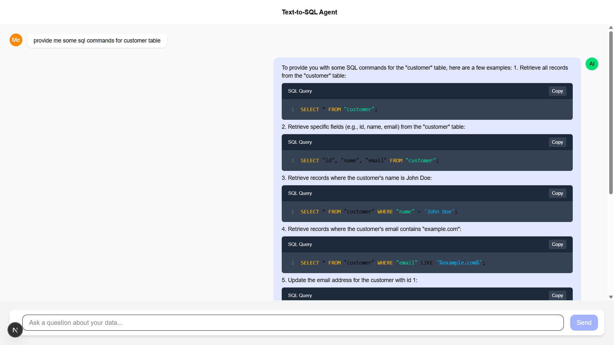

# Text-to-SQL Agent




## About
The Text-to-SQL Agent is an AI-powered tool built with Next.js that allows users to convert natural language queries into SQL commands and directly interact with a database. It utilizes LangChain, LangGraph, and Ollama to generate, execute, and refine SQL queries dynamically. The system can retrieve data from the database, enabling seamless interactions without requiring manual SQL writing.

## Features
- **Natural Language to SQL Conversion**: Converts user queries into SQL statements.
- **Direct Database Interaction**: Executes generated SQL queries and fetches results.
- **Multi-Step Query Processing**: Uses LangGraph for structured query generation.
- **Supports SQLite**: Works with SQLite databases for lightweight and fast execution.
- **Extensible and Modular**: Easily adaptable for other databases or additional AI capabilities.

## Technologies Used
- **Next.js**: Framework for building the frontend and backend.
- **LangChain**: For natural language processing and query generation.
- **LangGraph**: Enables structured decision-making for SQL refinement.
- **Ollama**: AI-powered model for query understanding.
- **SQLite**: Lightweight relational database engine.

## Installation

### Prerequisites
- Node.js (Latest LTS version recommended)
- SQLite installed
- WatsonX API credentials

### Setup
1. Clone the repository:
   ```sh
   git clone https://github.com/your-repo/text-to-sql-agent.git
   cd text-to-sql-agent
   ```
2. Install dependencies:
   ```sh
   npm install
   ```
3. Set up environment variables in a `.env.local` file:
   ```env
   WATSONX_AI_ENDPOINT=your_watsonx_endpoint
   WATSONX_AI_APIKEY=your_watsonx_apikey
   WATSONX_AI_PROJECT_ID=your_watsonx_project_id
   ```
4. Run the development server:
   ```sh
   npm run dev
   ```

## Usage
1. Open `http://localhost:3000` in your browser.
2. Enter a natural language query (e.g., *"Show me all customers who made a purchase last month"*).
3. The system will generate an SQL query and execute it on the database.
4. Results will be displayed on the interface.

## Contributing
1. Fork the repository.
2. Create a new branch: `git checkout -b feature-branch-name`.
3. Commit your changes: `git commit -m "Add new feature"`.
4. Push to the branch: `git push origin feature-branch-name`.
5. Open a pull request.

## License
This project is licensed under the MIT License.

